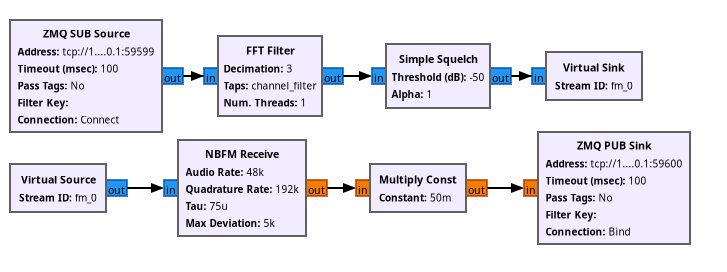

# GNU Radio in a container

This repository holds a proof of concept of packaging gnuradio flowgraphs into alpine linux docker container.

## Architectural goals

What I want to achieve with this is, to run flowgraphs seamlessly, is their dependencies are included into the container already. This might come in handy on the longterm.

The Flowgraphs to be included into such a container should contain ZMQ-Blocks for their input and output. I.e. like this:

Scenarios which I consider this useful:

- Decouple your GNU Radio application from the underlying OS and its GNU Radio version
- Combine blocks from different GNU Radio versions
- Spawn different flowgraphs in your transmission pipeline easily, i.e. for a GNU Radio based transceiver, working in different modes

## Limitations

I expect the containers to be run in the host network. This means, that you should not use the docker networking feature, but hang the containers directly into the host, as if there were merely processes.

To circumvent complicate redirections with i.e. audio devices, I expect flowgraphs using ZMQ-Blocks, which control Audio and Hardware and so on, to be run directly on the Host system, without a docker container.

## Further Notes

This is a proof of concept, which can be improved further. At the time of writing, an alpine image with GNU Radio in it takes around 780 MB. I expect this to be heavily improved, when dropping some stuff from the custom compiled GNU Radio. For example, one might drop audio support, as this will not be used anyway in this concept.
